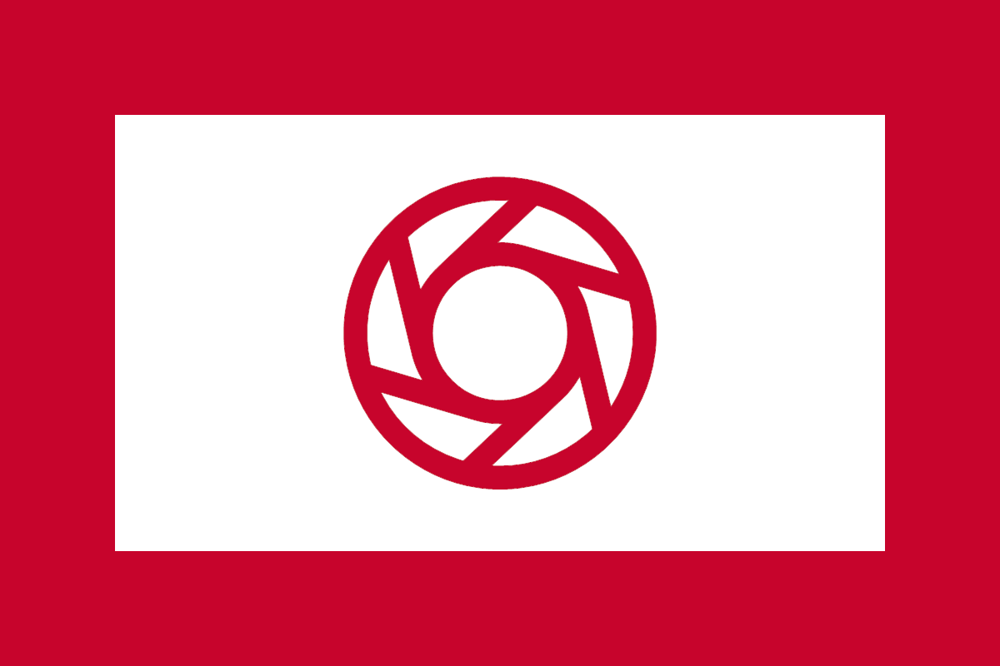
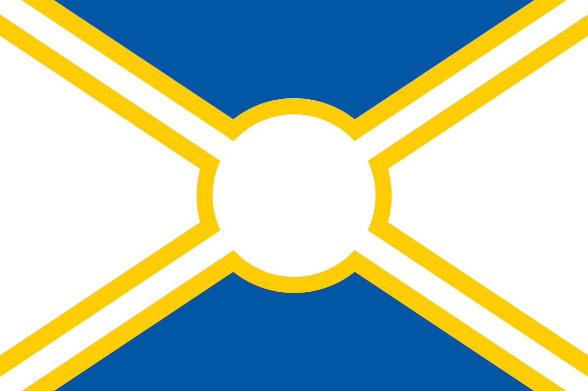
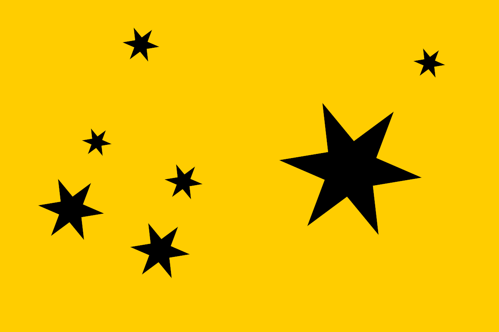
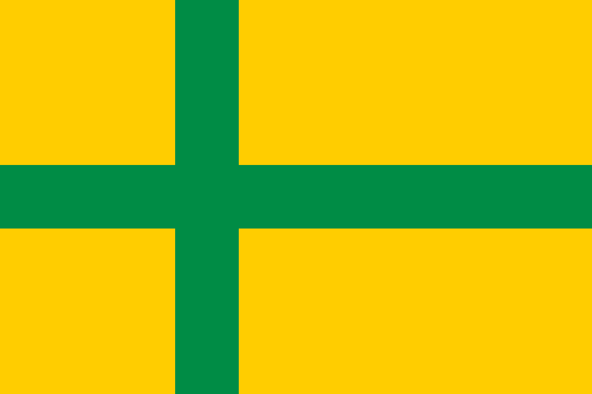
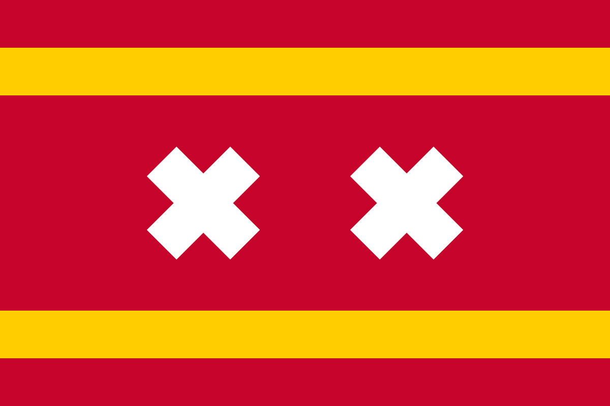
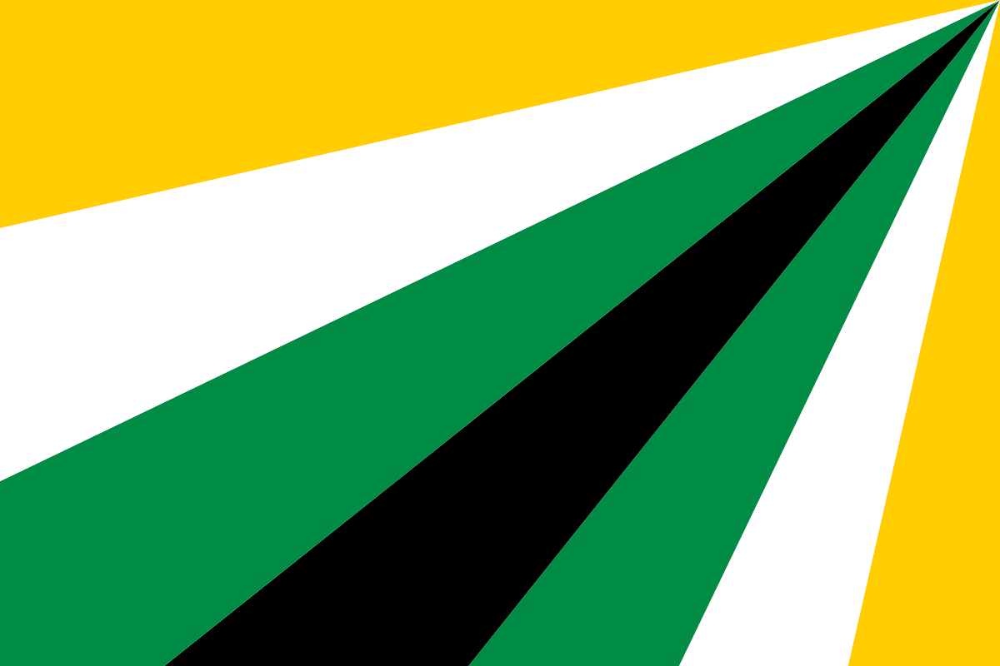
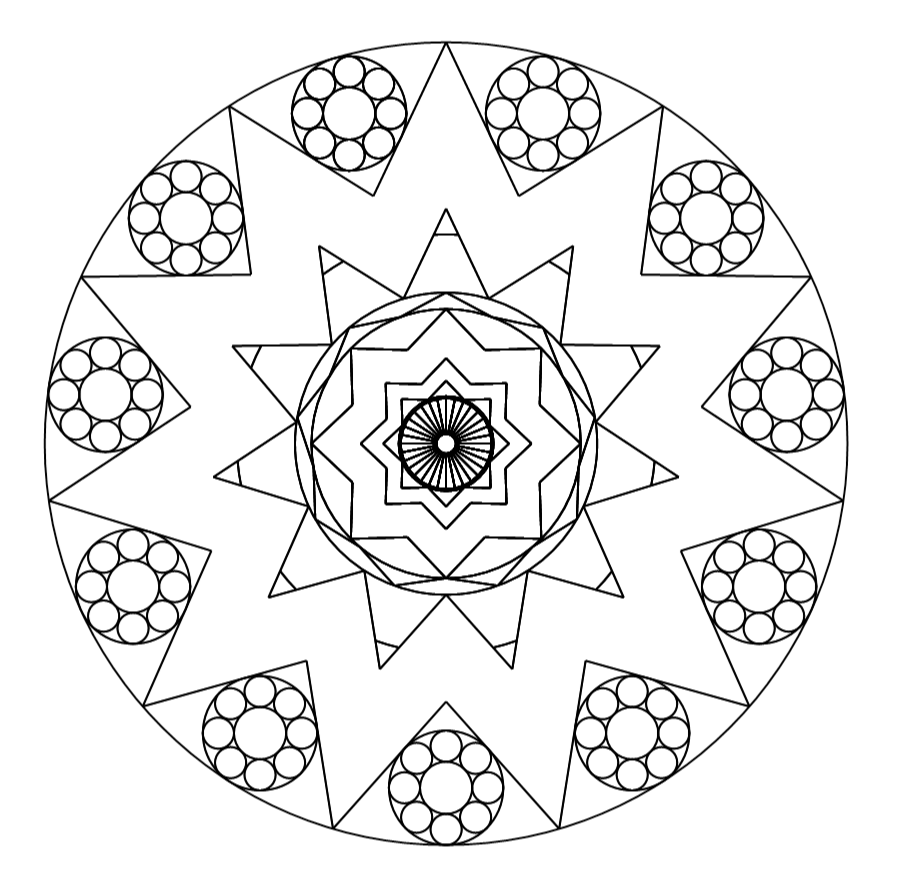
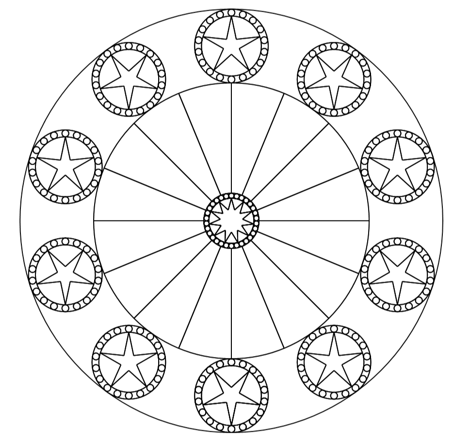
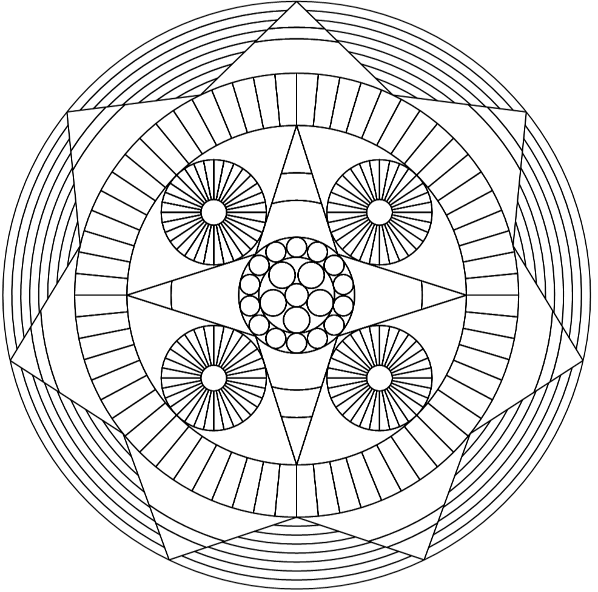

# Image Generation
This repository contains programs that procedurally generate images. All generation algorithms are my own and not dependant on external libraries. The only dependancy are libraries that provide basic functionalities for specific image formats (such as svg). Everything is written in C#. The repository contains one solution consisting of different projects, which are explained below.

# Flag Generator
This project generates flags. Inspired by real-world country flags, it should generate realistic but still very different outputs. There are no input settings other than the format of the image, but the flags that are generated will be completely random.

## Example Outputs
Here are some example outputs of the generator. To see more examples of generated flags, visit [my website](http://psvacha.net/tenthousandflags.html).
 

## How to use it yourself
You can use the generator yourself. If you want to use it in a bigger (commercial) project, please approach me first.
The generator is a simple console application. To generate flags, simply open your preferred CLI and follow these steps:
- Naviage to ../ImageGeneration/FlagGeneration/bin/Release
- Run FlagGeneration.exe with your parameters

The generator requires 4 parameters (in this order):
- directory: The absolute path of where your new image files with the flags will be saved.
- type: Must be "s" or "m". s generates a single flag with a specified seed, m generates multiple random flags.
- number: Must be a number. When generating a single flag, this number represents the seed. When generating multiple flags, this number represents the amount of flags.
- format: Must be "svg" or "png". The format of the generated image files.

Example:
To generate a single flag as a png with the seed 1312, run the command line with: "FlagGeneration.exe C:\MyGeneratedFlags s 1312 png"
To generate 10 random flags as svg's, run the command line with: "FlagGeneration.exe C:\MyGeneratedFlags m 10 svg"

# Mandala Generator
A generator to create mandalas. It is a windowed application. So to try it, simply run ../ImageGeneration/SvgMandalaGeneration/bin/Release/MandalaGeneration.exe

## Example Outputs
Here are some example outputs.

 

